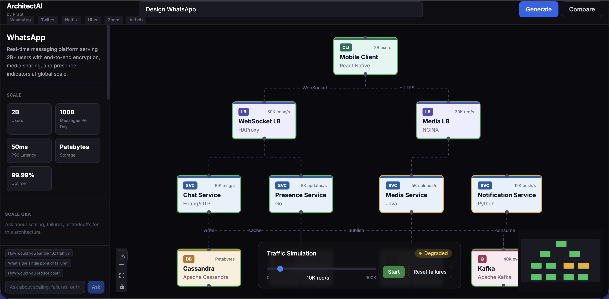
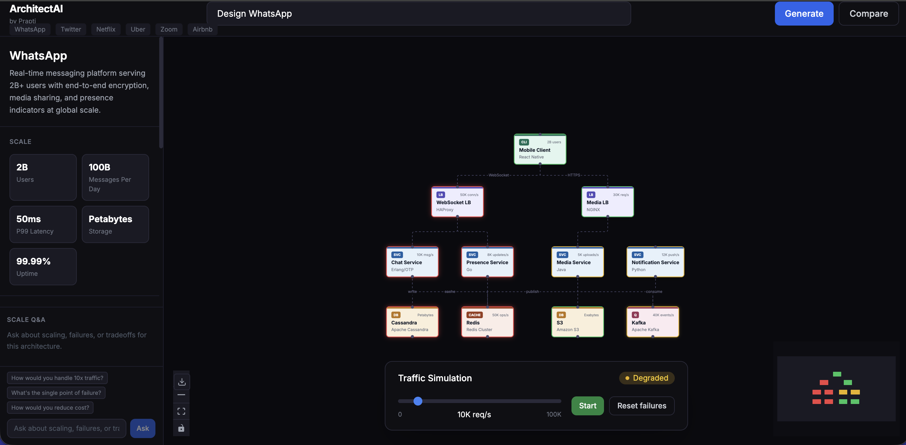
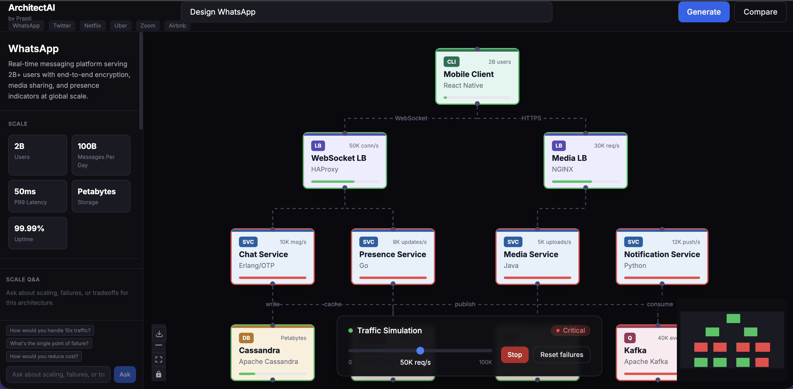
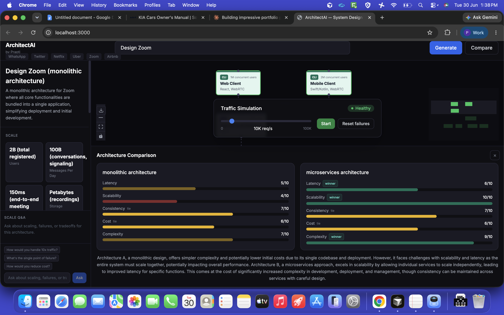

# ArchitectAI

**AI-powered system design simulator with live failure cascade and traffic simulation**

Built by [Prapti](https://github.com/prapti-jain)

ArchitectAI generates a live, animated system architecture from a single prompt, then lets you stress-test it. Type "Design Twitter," watch a real architecture appear on a canvas, click any node to simulate it failing, or crank up traffic to see which components degrade first.

     

---

## Overview



Type any system name and ArchitectAI calls Gemini to generate a structured architecture: nodes, edges, scale numbers, and engineering tradeoffs. Every generated system renders on an interactive canvas with custom node types for load balancers, services, databases, caches, and queues.

This isn't a static diagram tool. Two engineering features sit underneath the visuals:

## Failure cascade simulation



Click any node and the app runs a breadth-first search across the dependency graph to determine which downstream services go fully down versus which are only degraded. Nodes animate into failure state with a staggered delay, so cascading outages are visible as they propagate — the same way an incident actually unfolds.

## Traffic load simulation



A requests-per-second slider drives a load model across the graph. Entry nodes absorb full traffic and distribute it downstream proportionally through their edges. Each node has a configured capacity; cross 70% and it shows degraded, cross 90% and it's critical. The system health indicator reflects the worst node in the graph in real time.

## AI architecture comparison



Generate two variants of the same system — SQL vs NoSQL, monolith vs microservices, synchronous vs event-driven — and compare them side by side on five axes: latency, scalability, consistency, cost, and complexity. A third Gemini call summarizes the tradeoff in plain language.

## Scale Q&A

Ask follow-up questions about the currently generated architecture — "how would you handle 10x traffic?", "what's the single point of failure?" — and get answers grounded in the actual nodes and edges on screen, not generic advice.

---

## How it works

| Layer | What it does |
|---|---|
| Generation | `POST /api/generate` sends a structured prompt to Gemini 2.0 Flash, which returns a JSON graph (nodes, edges, scale numbers, tradeoffs, scores). Retried with exponential backoff on rate limits. |
| Failure cascade | `graphEngine.ts` builds a forward adjacency list from the edge data and runs BFS from the clicked node to determine cascade order and which nodes lose all upstream sources. |
| Traffic simulation | `simulationEngine.ts` propagates a requests/sec value through the graph proportional to edge throughput, comparing each node's load against its configured capacity. |
| Comparison | Two `/api/generate` calls run in parallel for each variant, followed by a `/api/compare-summary` call that sends a compacted graph summary (not full JSON) to keep the prompt small under rate limits. |
| Scale Q&A | `/api/ask` passes the current graph as context alongside the user's question, so answers reference real node names instead of generic system design advice. |

## Tech stack

**Frontend** — Next.js 14, TypeScript, Tailwind CSS, [@xyflow/react](https://reactflow.dev) (React Flow v12), html-to-image for PNG export

**Backend** — FastAPI, Python, [google-genai](https://github.com/googleapis/python-genai) SDK, Gemini 2.0 Flash

## Running locally

Requires Node 18+, Python 3.11+, and a [Gemini API key](https://aistudio.google.com/apikey).

```bash
git clone git@github.com:prapti-jain/architectai.git
cd architectai
```

**Backend**
```bash
cd backend
python3 -m venv .venv
source .venv/bin/activate
pip install -r requirements.txt
echo "GEMINI_API_KEY=your_key_here" > .env
uvicorn main:app --reload --port 8000
```

**Frontend** — in a second terminal
```bash
cd frontend
npm install
echo "NEXT_PUBLIC_API_URL=http://localhost:8000" > .env.local
npm run dev
```

Or from the project root, once both `.env` files are in place:
```bash
./start.sh
```

Open `localhost:3000`, type a system name, and hit Generate.

## Project structure

```
architectai/
├── frontend/
│   ├── app/                  # Next.js app router
│   ├── components/           # Canvas, sidebar, node types, chat, compare panel
│   ├── hooks/                 # useArchitecture, useFailureCascade, useSimulation, useScaleChat
│   └── lib/
│       ├── graphEngine.ts     # BFS failure cascade
│       ├── simulationEngine.ts # traffic load propagation
│       └── types.ts
├── backend/
│   ├── main.py                # FastAPI app, Gemini integration
│   ├── prompts/                # system design prompt templates
│   └── models/                 # Pydantic schemas
└── start.sh                    # runs both services
```

## What this project is not

This isn't a wrapper around a single prompt. The architecture generation is one of five engineering pieces — the other four (failure cascade traversal, load simulation, multi-call comparison with retry logic, and context-grounded Q&A) are deterministic code that runs independently of the LLM call. The AI generates the architecture; the simulation engines reason about it.
