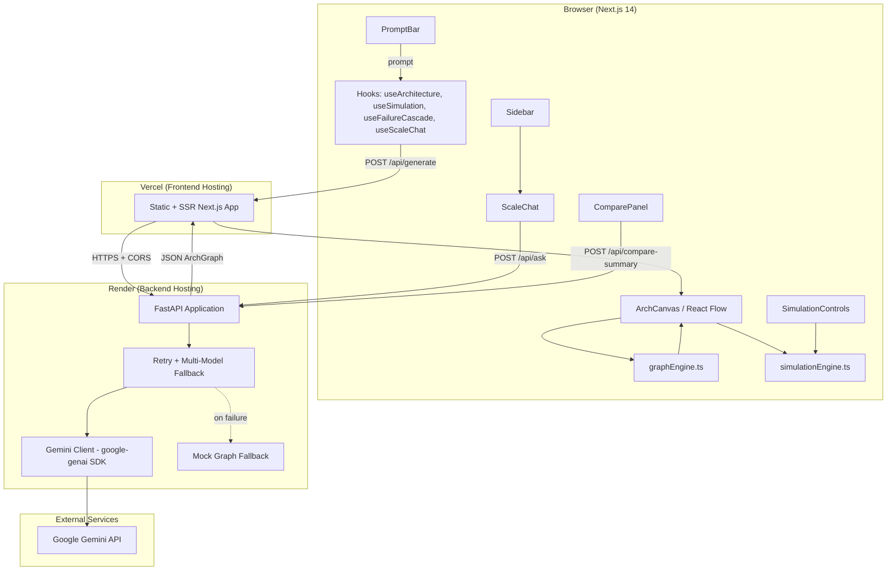

# ArchitectAI

**Developer:** Prapti Jain  
**Date:** July 5, 2026  
**GitHub:** https://github.com/prapti-jain/architectai  
**Live Frontend:** https://architectai-y9wy.vercel.app  
**Live Backend:** https://architectai-backend-llv6.onrender.com  

---

## Abstract

ArchitectAI is a full-stack system design simulator that converts natural-language prompts into interactive architecture diagrams. A user describes a system—such as Netflix or a hospital booking platform—and the application calls Google Gemini to produce a structured graph of nodes, edges, scale metrics, and engineering tradeoffs. That graph is rendered on a React Flow canvas where the user can simulate traffic load, trigger failure cascades, compare architectural variants, and ask scale-related questions grounded in the live diagram.

The project is technically non-trivial because it combines LLM structured-output parsing, graph algorithms (BFS cascade and load propagation), real-time UI state across multiple hooks, and production deployment across two services with CORS, retry logic, and graceful degradation when API quota is exhausted. The engineering work extends well beyond a chat wrapper: the frontend implements two custom simulation engines, six typed node components, and a comparison workflow that coordinates three Gemini calls without rate-limit cascades.

---

## Problem Statement

System design interview preparation is largely manual and static. Candidates draw boxes on a whiteboard or read blog posts, but neither approach lets them observe how an architecture behaves under stress or partial failure.

Existing tooling falls into two inadequate categories. Static diagram tools (draw.io, Excalidraw) produce visuals but offer no simulation, dependency analysis, or AI-assisted reasoning. Generic chatbots can discuss system design in prose but cannot produce a machine-readable graph that drives an interactive canvas.

There is no integrated tool that (1) generates a production-style architecture from a prompt, (2) lets the user stress-test it with simulated traffic, (3) models failure propagation through service dependencies, and (4) supports side-by-side comparison of design variants—all in one interface.

---

## Solution Overview

ArchitectAI addresses this gap by treating an architecture as a typed directed graph that both the UI and the LLM can operate on. The solution is built around five engineering components, not just the AI generation layer:

1. **AI architecture generation** — Gemini returns JSON matching a strict schema; the backend validates it with Pydantic before the frontend renders it.
2. **BFS failure cascade engine** — Clicking a node triggers breadth-first propagation through the dependency graph, distinguishing fully-down nodes from partially degraded ones.
3. **Traffic load simulation engine** — Request volume propagates from entry nodes through edges proportional to throughput weights, producing per-node load and system health status.
4. **Multi-call architecture comparison** — Two parallel generation calls produce variant graphs; a delayed third call generates a compact AI summary of tradeoffs.
5. **Context-grounded Scale Q&A** — The full current graph is injected into the prompt so answers reference actual node names and technologies.

When Gemini is unavailable, the system falls back to a reference topology while preserving the user's system name and surfacing a visible demo-mode banner—keeping the simulator functional for portfolio demos.

---

## System Architecture

### High-Level Architecture Diagram



### Data Flow

1. User enters a prompt (e.g., "Design Netflix") in `PromptBar`.
2. `useArchitecture` sends `POST /api/generate` with `{ prompt, variant? }` to the FastAPI backend.
3. Backend concatenates `SYSTEM_DESIGN_PROMPT` with the user prompt and calls `generate_content_with_retry()`.
4. Gemini returns raw JSON describing nodes, edges, tradeoffs, and scores.
5. Backend strips markdown fences, parses JSON, validates via Pydantic `ArchGraph`, and returns `{ graph, source }`.
6. Frontend maps nodes to React Flow elements with custom node types and renders the canvas.
7. User interactions (failure clicks, traffic slider, compare, Q&A) invoke local engines or additional API endpoints.

### Frontend Architecture

**Component tree (simplified):**

```
app/page.tsx
├── PromptBar
├── Sidebar
│   └── ScaleChat
├── ArchCanvas
│   └── NodeTypes (Client, LoadBalancer, Service, Database, Cache, Queue)
├── SimulationControls
└── ComparePanel
```

**Hooks:**

| Hook | Responsibility |
|------|----------------|
| `useArchitecture` | Fetch/generate graphs, dual comparison, mock banner state |
| `useSimulation` | Drive traffic simulation interval, load map, system health |
| `useFailureCascade` | Manage failed/affected node sets with timed cascade |
| `useScaleChat` | POST questions with current graph context |

**Lib engines:**

| Module | Responsibility |
|--------|----------------|
| `lib/types.ts` | Shared TypeScript interfaces and enums |
| `lib/graphEngine.ts` | Adjacency lists, BFS cascade, load/status helpers |
| `lib/simulationEngine.ts` | Traffic propagation and system health |
| `lib/mockData.ts` | Default WhatsApp reference graph for initial load |

### Backend Architecture

**Endpoints:** `/health`, `/api/generate`, `/api/ask`, `/api/compare-summary`, `/api/test-gemini`

**Key modules:**

| Module | Responsibility |
|--------|----------------|
| `main.py` | FastAPI app, Gemini integration, retry logic, CORS |
| `models/schemas.py` | Pydantic request/response models |
| `prompts/system_design.py` | Structured JSON schema prompt template |

**Retry logic:** Up to 3 attempts per model with 1s and 3s backoff on 429/503 errors, cycling through `gemini-2.5-flash-lite`, `gemini-2.5-flash`, `gemini-2.0-flash-lite`, and `gemini-2.0-flash`.

---

## Technical Components

### 6.1 BFS-Based Failure Cascade Engine

**Problem it solves:** When a service fails in a distributed system, downstream dependencies may fail entirely or operate in a degraded state depending on redundancy. Static diagrams cannot demonstrate this behavior.

**Algorithm:** The engine builds forward and reverse adjacency lists from `ArchEdge[]`. On node failure, BFS traverses forward edges. A downstream node is marked fully down only when **all** of its upstream dependencies are down—modeling hard dependencies rather than naive one-hop propagation.

**Fully-down vs degraded:**

- **Fully down:** Node is in the BFS cascade set (all upstream paths blocked).
- **Degraded (partially affected):** Node has multiple upstream sources; at least one is down but not all (`getPartiallyAffected` in `graphEngine.ts`).

**Code location:** `frontend/lib/graphEngine.ts` — functions `buildAdjacencyList`, `getFailureCascade`, `getPartiallyAffected`.

**UI integration:** `useFailureCascade` applies cascade steps with 300ms delays for visual animation. `ArchCanvas` renders failed nodes with red borders and affected nodes with yellow borders.

---

### 6.2 Traffic Load Simulation Engine

**Problem it solves:** Interview discussions often reference capacity and saturation, but candidates rarely see numeric load per component. This engine approximates how traffic distributes across a topology.

**Load propagation:** Entry nodes (no incoming edges) receive the user-specified `requestsPerSec`. Traffic flows to downstream nodes proportional to each edge's `throughput` weight relative to total outgoing throughput from the source node. Per-node load is `traffic / capacity`, clamped to `[0, 1]`.

**Capacity thresholds:**

| Load | Status |
|------|--------|
| ≤ 70% | Healthy |
| > 70%, ≤ 90% | Degraded |
| > 90% | Critical (treated as down in node status helpers) |

**System health:** `getSystemHealth()` returns `critical` if any node exceeds 90%, `degraded` if any exceeds 70%, otherwise `healthy`.

**Code location:** `frontend/lib/simulationEngine.ts` — functions `calculateAllLoads`, `getSystemHealth`.

**UI integration:** `SimulationControls` exposes a 0–100,000 req/s slider; `ArchCanvas` shows load bars on nodes when simulation is running.

---

### 6.3 Gemini API Integration with Retry Logic

**Problem it solves:** LLM APIs return unstructured text, hit rate limits unpredictably, and fail silently without fallback UX.

**Structured JSON prompt engineering:** `SYSTEM_DESIGN_PROMPT` in `prompts/system_design.py` defines the exact JSON schema—node types, positioning rules (y-layers for CLIENT/LB/SERVICE/DATA), edge structure, tradeoffs, scale numbers, and scores. The prompt explicitly forbids markdown fences.

**`generate_content_with_retry()`:** Iterates through a model fallback chain. For each model, up to 3 attempts are made. Retryable errors (429, 503, `RESOURCE_EXHAUSTED`, `UNAVAILABLE`) trigger 1s then 3s backoff. Non-retryable errors or exhausted models advance to the next model in the chain.

**Fallback strategy:** On any unrecoverable failure, `call_gemini()` returns `get_mock_graph()` with the user's system name extracted from the prompt and `source: "mock"`. The frontend displays a yellow banner when `source === "mock"`.

**Code location:** `backend/main.py` — functions `generate_content_with_retry`, `call_gemini`, `call_gemini_text`, `get_mock_graph`.

---

### 6.4 Multi-Call Architecture Comparison

**Problem it solves:** System design interviews frequently ask candidates to compare approaches (SQL vs NoSQL, monolith vs microservices). A single generation call cannot produce two contrasting variants simultaneously.

**Parallel generation:** `useArchitecture.generateDualComparison()` fires two concurrent `POST /api/generate` calls with different `variant` strings (e.g., "SQL/relational database approach" vs "NoSQL/distributed database approach"). Each call includes variant-specific instructions appended to the user prompt.

**Token reduction:** Before the summary call, `compact_graph_summary()` strips the graph to system name, node labels/types, and scores—avoiding full JSON serialization of positions and descriptions.

**Rate limit mitigation:** `ComparePanel` waits 2 seconds (`SUMMARY_DELAY_MS`) after both graphs render before calling `POST /api/compare-summary`, reducing the chance of a third immediate 429 after two generation calls.

**Retry summary button:** If the summary call fails (`success: false`), the UI shows a "Retry summary" button that re-fetches with zero delay, using a `fetchIdRef` to cancel stale responses on unmount.

**Code location:** `backend/main.py` (`compare_summary`, `compact_graph_summary`), `frontend/components/ComparePanel.tsx`, `frontend/hooks/useArchitecture.ts`.

---

### 6.5 Context-Grounded Scale Q&A

**Problem it solves:** Generic LLM answers to scaling questions lack specificity. Answers should reference the actual services, databases, and bottlenecks in the diagram the user is viewing.

**RAG-adjacent pattern:** Rather than retrieving from a vector store, the entire current `ArchGraph` is serialized to JSON and injected into the prompt: *"Here is the current architecture: {graph_json}. The user asks: {question}."* The instruction requires 2–4 sentence answers referencing actual node names.

**Frontend flow:** `ScaleChat` renders suggested question chips and a message history. `useScaleChat` posts to `POST /api/ask` with `{ question, graph }`.

**Code location:** `backend/main.py` (`ask_scale_question`), `frontend/components/ScaleChat.tsx`, `frontend/hooks/useScaleChat.ts`.

---

## Challenges and Solutions

### Python 3.14 pydantic-core Wheel Incompatibility

Creating a virtual environment with Python 3.14 caused `pydantic-core` to attempt a source build, which failed due to missing Rust toolchain compatibility. **Solution:** Relaxed version pins to `pydantic>=2.10.2` and `pydantic-core>=2.27.1`, and standardized on the existing Python 3.9 venv for backend execution via `.venv/bin/python -m uvicorn` rather than relying on shell activation that picked up the wrong interpreter.

### Deprecated google-generativeai SDK Migration to google-genai

The original `google-generativeai` package is deprecated. **Solution:** Migrated to `google-genai>=1.0.0` with `from google import genai` and `client.models.generate_content()`. Updated `requirements.txt` and refactored all API calls in `main.py`.

### TypeScript Strict Mode Failures Caught Only in Vercel Production Build

Local `npm run dev` did not surface type errors that blocked `next build`. `NodeData` extended `ArchNode` but re-declared `currentLoad` as optional while the base type required it. **Solution:** Made `currentLoad?: number` on `ArchNode` in `lib/types.ts`, fixed the cast in `BaseNode.tsx`, and added `"target": "es2017"` to `tsconfig.json` to resolve `Set`/`Map` iteration errors under strict compilation.

### Rate Limit Cascades Under Concurrent Gemini API Calls

Comparison mode triggered two simultaneous generation calls followed immediately by a summary call, producing 429 `RESOURCE_EXHAUSTED` errors on the free tier. **Solution:** Implemented multi-model fallback chain, per-model retry with 1s/3s backoff, compact graph summaries to reduce token usage, and a 2-second delay before the compare-summary request. Added a manual retry button for failed summaries.

### Git Binary File Tracking Issue with Screenshots

Architecture screenshots added to the README were initially tracked incorrectly or bloated the repository. **Solution:** Ensured screenshots were committed as standard PNG assets in a dedicated directory, referenced via relative paths in the README, and excluded unrelated test artifacts (e.g., `test-download.png`) from commits.

---

## API Documentation

| Endpoint | Method | Request Body | Response | Purpose |
|----------|--------|--------------|----------|---------|
| `/health` | GET | — | `{ "status": "ok" }` | Liveness check for deployment monitoring |
| `/api/generate` | POST | `{ "prompt": string, "variant"?: string }` | `{ "graph": ArchGraph, "source": "gemini" \| "mock" }` | Generate architecture from natural-language prompt |
| `/api/ask` | POST | `{ "question": string, "graph": ArchGraph }` | `{ "answer": string, "success": boolean }` | Context-grounded scale Q&A |
| `/api/compare-summary` | POST | `{ "graph_a": ArchGraph, "graph_b": ArchGraph }` | `{ "summary": string, "success": boolean }` | AI summary of two architecture variants |
| `/api/test-gemini` | GET | — | `{ "success": boolean, "raw"?: string, "error"?: string }` | Smoke test for Gemini connectivity and quota |

**ArchGraph schema (abbreviated):**

```json
{
  "system": "string",
  "description": "string",
  "nodes": [{ "id", "type", "label", "description", "tech", "scale", "capacity", "position", "status", "currentLoad" }],
  "edges": [{ "id", "source", "target", "label?", "animated", "throughput" }],
  "tradeoffs": ["string"],
  "scale_numbers": { "key": "value" },
  "scores": { "latency", "scalability", "consistency", "cost", "complexity" }
}
```

---

## Project Metrics

| Metric | Value |
|--------|-------|
| Architecture generation response time | 8–15 seconds per request |
| Nodes per generated architecture | 8–14 (enforced in prompt) |
| Traffic simulation range | 0–100,000 req/s |
| Gemini calls per comparison | 3 (2× generate + 1× summary) |
| Retry attempts per model | 3 (with 1s, 3s backoff) |
| Frontend TypeScript/TSX source files | 26 |
| Production build First Load JS | 158 kB |
| Custom React Flow node types | 6 (Client, LoadBalancer, Service, Database, Cache, Queue) |
| Total Git commits | 6 |
| Deployment platforms | Vercel (frontend), Render (backend, free tier) |

---

## Tech Stack

| Technology | Purpose |
|------------|---------|
| **Next.js 14** | React framework with App Router, SSR/SSG, production builds |
| **TypeScript** | Static typing across frontend components, hooks, and engines |
| **Tailwind CSS** | Utility-first styling for dark-theme UI |
| **React 18** | Component model, hooks, client-side state |
| **@xyflow/react v12** | Interactive node-edge diagram canvas |
| **html-to-image** | PNG export of architecture diagrams |
| **FastAPI** | Python async REST API framework |
| **Uvicorn** | ASGI server for FastAPI |
| **Pydantic v2** | Request/response validation and schema enforcement |
| **python-dotenv** | Environment variable loading for API keys |
| **google-genai SDK** | Google Gemini API client (`generate_content`) |
| **Google Gemini 2.x Flash** | LLM for architecture generation, Q&A, and summaries |
| **PostCSS / Autoprefixer** | CSS processing pipeline for Tailwind |

---

## Future Improvements

- **Real-time collaborative architecture editing** — Multiple users editing the same graph with operational transform or CRDT sync.
- **Export to Terraform / infrastructure-as-code** — Map node types to cloud resource definitions for automated provisioning sketches.
- **Support for custom node types** — User-defined node categories beyond the six built-in types.
- **WebSocket-based live updates during generation** — Stream partial graph nodes as Gemini produces them instead of waiting for full JSON.
- **Authentication and saved architecture history** — Persist generated architectures per user with version history and shareable links.

---

## Conclusion

ArchitectAI demonstrates end-to-end full-stack engineering: structured LLM integration, graph algorithms, interactive visualization, production deployment across two platforms, and defensive handling of API failures. Building the failure cascade and traffic engines required reasoning about distributed system behavior in code—not just describing it in text. Deploying to Vercel and Render surfaced real integration issues (CORS, environment variables, TypeScript strict builds) that local development alone did not expose.

The project shows capability in API design, prompt engineering for structured output, frontend state architecture with custom hooks, and pragmatic degradation strategies when external services are unavailable. It is intended as a portfolio piece for software engineering internships, combining AI tooling with substantive systems programming.

---

*Report generated for ArchitectAI by Prapti Jain — July 2026*
